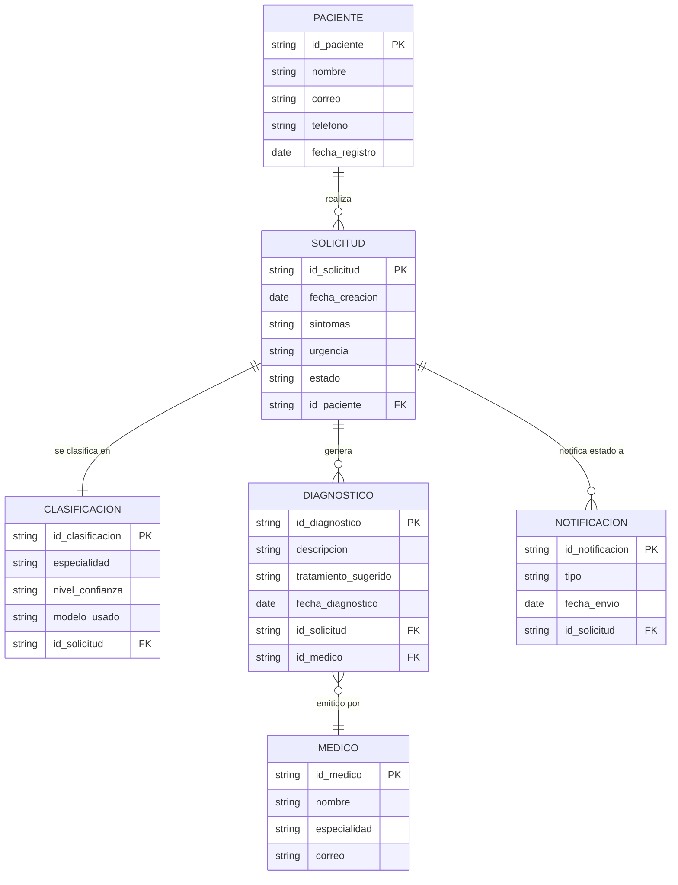

 # Actividad II - Construyendo Diagramas con GenAI
**Curso:** IA para Negocios Digitales  
**Equipo:** FarmaNova  
**Integrantes:** Juan Fernando Arenas, Yessica Paola Duarte, María Natalia Muñetones William Moreno Romero y Juan Fernando Arenas

**Fecha:** 8 de noviembre de 2025

---

## Contexto del Caso

FarmaNova es una empresa farmacéutica que recibe solicitudes técnicas y médicas a través de diferentes canales (web, correo y teléfono). El proceso actual involucra clasificación manual por tipo de especialidad, urgencia y validaciones regulatorias.  
El equipo propone explorar el uso de **modelos generativos (GenAI)** para automatizar la clasificación, documentación y comunicación con los solicitantes, reduciendo tiempos de respuesta y errores humanos.

---

## Prompt #1 (ChatGPT)

> Dame un ejemplo de un diagrama de secuencia en PlantUML de una app que clasifique solicitudes médicas automáticamente.

### Respuesta de ChatGPT
```plantuml
@startuml
actor Usuario
participant "Help Desk" as HD
participant "API Clasificación IA" as API
participant "Base de Datos" as DB

Usuario -> HD : Envía solicitud médica
HD -> API : Envía texto a analizar
API -> DB : Consulta categorías previas
API -> API : Clasifica solicitud con modelo LLM
API --> HD : Devuelve categorías y nivel de urgencia
HD -> DB : Registra resultado
HD --> Usuario : Notifica ticket clasificado
@enduml


---

## Prompt #1 (Claude)

> Dame un ejemplo de un diagrama de secuencia en PlantUML de una app que clasifique solicitudes médicas automáticamente.

### Respuesta de Claude
```mermaid
sequenceDiagram
    actor Paciente
    participant App as App Móvil
    participant API as API Gateway
    participant Auth as Servicio de Autenticación
    participant SR as Servicio de Solicitudes
    participant IA as Motor de IA Clasificación
    participant NLP as Servicio NLP Procesamiento
    participant KB as Base de Conocimiento
    participant NT as Servicio de Notificaciones
    participant DB as Base de Datos
    participant Portal as Portal Médico
    actor Médico
    sequenceDiagram
    actor Paciente
    participant App as App Móvil
    participant API as API Gateway
    participant Auth as Servicio de<br/>Autenticación
    participant SR as Servicio de<br/>Solicitudes
    participant IA as Motor de IA<br/>Clasificación
    participant NLP as Servicio NLP<br/>Procesamiento
    participant KB as Base de<br/>Conocimiento
    participant NT as Servicio de<br/>Notificaciones
    participant DB as Base de Datos
    participant Portal as Portal<br/>Médico
    actor Médico

    rect rgb(230, 240, 255)
        Note over Paciente,Médico: REGISTRO DE SOLICITUD
        
        Paciente->>App: Abre app y accede a "Nueva Consulta"
        activate App
        
        App->>API: POST /auth/verify-session
        activate API
        API->>Auth: Validar token de sesión
        activate Auth
        Auth->>DB: Verificar usuario activo
        activate DB
        DB-->>Auth: Datos del paciente
        deactivate DB
        Auth-->>API: Usuario autenticado
        deactivate Auth
        API-->>App: Sesión válida
        deactivate API
        
        App-->>Paciente: Muestra formulario de síntomas
        
        Paciente->>App: Ingresa síntomas, duración<br/>y sube foto (opcional)
        
        App->>API: POST /requests/create<br/>{symptoms, duration, images, metadata}
        activate API
        API->>SR: Crear nueva solicitud
        activate SR
        
        SR->>DB: Guardar solicitud (estado: "pendiente")
        activate DB
        DB-->>SR: ID solicitud creada
        deactivate DB
        
        SR-->>API: Solicitud registrada
        deactivate SR
        API-->>App: ID: 12345 - En análisis
        deactivate API
        
        App-->>Paciente: "Estamos analizando tu solicitud..."
        deactivate App
    end

    rect rgb(255, 245, 230)
        Note over SR,KB: ANÁLISIS Y CLASIFICACIÓN CON IA
        
        SR->>IA: Iniciar clasificación (solicitud_id: 12345)
        activate SR
        activate IA
        
        IA->>NLP: Analizar texto de síntomas
        activate NLP
        
        NLP->>NLP: Tokenización y limpieza
        NLP->>NLP: Extracción de entidades médicas<br/>(síntomas, partes del cuerpo)
        NLP->>KB: Buscar términos médicos relacionados
        activate KB
        KB-->>NLP: Términos normalizados y sinónimos
        deactivate KB
        
        NLP-->>IA: Texto procesado y entidades<br/>{fiebre, dolor_cabeza, mareo}
        deactivate NLP
        
        alt Si hay imágenes adjuntas
            IA->>IA: Análisis de imagen con CNN
            Note right of IA: Detecta lesiones,<br/>erupciones, etc.
        end
        
        IA->>KB: Consultar reglas de clasificación<br/>y patrones históricos
        activate KB
        KB->>DB: Query casos similares
        activate DB
        DB-->>KB: Historial de casos resueltos
        deactivate DB
        KB-->>IA: Reglas y patrones
        deactivate KB
        
        IA->>IA: Modelo ML predice:<br/>- Nivel de urgencia<br/>- Especialidad sugerida<br/>- Confianza del diagnóstico
        
        Note right of IA: Algoritmo considera:<br/>1. Severidad de síntomas<br/>2. Duración<br/>3. Combinación de síntomas<br/>4. Historial del paciente<br/>5. Factores de riesgo
        
        IA-->>SR: Resultado clasificación:<br/>{<br/>  urgencia: "MEDIA",<br/>  especialidad: "Medicina General",<br/>  confianza: 0.87,<br/>  tiempo_sugerido: "24h"<br/>}
        deactivate IA
    end

    rect rgb(240, 255, 240)
        Note over SR,Portal: ASIGNACIÓN Y NOTIFICACIÓN
        
        SR->>DB: Actualizar solicitud con clasificación
        activate DB
        DB-->>SR: Estado actualizado
        deactivate DB
        
        alt Urgencia ALTA (Emergencia)
            SR->>NT: Notificación urgente
            activate NT
            NT->>Portal: Alerta en tiempo real
            NT->>Médico: SMS + Push + Email
            NT-->>SR: Notificaciones enviadas
            deactivate NT
            Note right of Médico: Respuesta inmediata<br/>requerida
            
        else Urgencia MEDIA
            SR->>DB: Buscar médico disponible<br/>en especialidad
            activate DB
            DB-->>SR: Lista de médicos disponibles
            deactivate DB
            
            SR->>SR: Algoritmo de asignación<br/>(carga de trabajo, especialidad)
            
            SR->>DB: Asignar a Dr. García
            activate DB
            DB-->>SR: Asignación confirmada
            deactivate DB
            
            SR->>NT: Notificar a médico y paciente
            activate NT
            NT->>Portal: Actualizar cola de Dr. García
            activate Portal
            Portal-->>Médico: Nueva solicitud en cola
            NT->>App: Push notification
            activate App
            App-->>Paciente: "Tu solicitud fue clasificada<br/>y asignada a un médico"
            deactivate App
            NT-->>SR: Confirmación de notificaciones
            deactivate NT
            
        else Urgencia BAJA
            SR->>DB: Agregar a cola general
            activate DB
            DB-->>SR: En cola
            deactivate DB
            
            SR->>NT: Notificación estándar
            activate NT
            NT->>App: Push notification
            activate App
            App-->>Paciente: "Recibirás respuesta<br/>en 48-72 horas"
            deactivate App
            NT-->>SR: Enviado
            deactivate NT
        end
        
        deactivate SR
    end

    rect rgb(255, 240, 245)
        Note over Portal,Médico: REVISIÓN MÉDICA
        
        Médico->>Portal: Accede a solicitud clasificada
        activate Portal
        
        Portal->>API: GET /requests/12345/details
        activate API
        API->>SR: Obtener detalles completos
        activate SR
        SR->>DB: Query solicitud + clasificación IA
        activate DB
        DB-->>SR: Datos completos
        deactivate DB
        SR-->>API: Detalles de solicitud
        deactivate SR
        API-->>Portal: Información completa + sugerencia IA
        deactivate API
        
        Portal-->>Médico: Muestra:<br/>- Síntomas del paciente<br/>- Clasificación IA (87% confianza)<br/>- Historial médico<br/>- Sugerencias de diagnóstico
        
        alt Médico está de acuerdo con clasificación
            Médico->>Portal: Confirma clasificación IA<br/>y añade diagnóstico
            Portal->>API: PUT /requests/12345/diagnosis
            activate API
            API->>SR: Guardar diagnóstico médico
            activate SR
            SR->>DB: Actualizar con diagnóstico<br/>y feedback positivo para IA
            activate DB
            DB-->>SR: Guardado
            deactivate DB
            SR->>IA: Feedback: clasificación correcta
            activate IA
            IA->>IA: Actualizar modelo (refuerzo)
            deactivate IA
            SR-->>API: Diagnóstico registrado
            deactivate SR
            API-->>Portal: Confirmado
            deactivate API
            
        else Médico reclasifica
            Médico->>Portal: Modifica urgencia/especialidad<br/>y añade diagnóstico
            Portal->>API: PUT /requests/12345/reclassify
            activate API
            API->>SR: Actualizar clasificación
            activate SR
            SR->>DB: Guardar nueva clasificación<br/>y razón del cambio
            activate DB
            DB-->>SR: Actualizado
            deactivate DB
            SR->>IA: Feedback: clasificación incorrecta<br/>{razón, clasificación_correcta}
            activate IA
            IA->>IA: Aprendizaje: ajustar pesos<br/>del modelo
            deactivate IA
            SR-->>API: Reclasificación guardada
            deactivate SR
            API-->>Portal: Confirmado
            deactivate API
            
            Note right of IA: El sistema mejora<br/>continuamente con<br/>feedback médico
        end
        
        Portal-->>Médico: "Diagnóstico enviado al paciente"
        deactivate Portal
    end

    rect rgb(245, 245, 250)
        Note over App,DB: NOTIFICACIÓN AL PACIENTE
        
        SR->>NT: Enviar respuesta a paciente
        activate SR
        activate NT
        NT->>App: Push + Email con diagnóstico
        activate App
        App-->>Paciente: "Tienes una respuesta<br/>de tu médico"
        deactivate App
        
        NT->>DB: Registrar notificación enviada
        activate DB
        DB-->>NT: OK
        deactivate DB
        NT-->>SR: Paciente notificado
        deactivate NT
        deactivate SR
        
        Paciente->>App: Abre notificación
        activate App
        App->>API: GET /requests/12345/diagnosis
        activate API
        API->>DB: Obtener diagnóstico
        activate DB
        DB-->>API: Diagnóstico completo
        deactivate DB
        API-->>App: Respuesta médica
        deactivate API
        
        App-->>Paciente: Muestra diagnóstico,<br/>tratamiento y recomendaciones
        
        Paciente->>App: Califica la atención
        App->>API: POST /requests/12345/rating<br/>{rating: 5, feedback}
        activate API
        API->>DB: Guardar calificación
        activate DB
        DB-->>API: Guardado
        deactivate DB
        API-->>App: Gracias por tu feedback
        deactivate API
        
        App-->>Paciente: "Esperamos haberte ayudado"
        deactivate App
    end

    rect rgb(250, 250, 255)
        Note over IA,KB: MEJORA CONTINUA DEL SISTEMA
        
        loop Proceso diario automático
            IA->>DB: Analizar solicitudes del día
            activate IA
            activate DB
            DB-->>IA: Datos de clasificaciones<br/>y feedback médico
            deactivate DB
            
            IA->>IA: Calcular métricas:<br/>- Precisión<br/>- Concordancia con médicos<br/>- Tiempo de respuesta
            
            alt Precisión < 85%
                IA->>IA: Reentrenar modelo con<br/>nuevos datos
                IA->>KB: Actualizar reglas de clasificación
                activate KB
                KB-->>IA: Reglas actualizadas
                deactivate KB
                Note right of IA: Sistema de<br/>auto-mejora
            end
            deactivate IA
        end
    end

---

## Análisis comparativo y reflexiones

El ejercicio de generación de diagramas con ChatGPT y Claude permitió observar enfoques radicalmente distintos en la comprensión y representación del mismo proceso.  
ChatGPT ofreció un modelo **estructurado, conciso y técnico**, alineado con un enfoque de documentación formal (PlantUML). Su diagrama prioriza la trazabilidad de interacciones clave y la claridad para desarrolladores.  
Claude, en contraste, produjo un **modelo narrativo y holístico**, expandiendo el flujo a un sistema completo con capas de autenticación, análisis NLP, aprendizaje continuo y retroalimentación médica. Aunque menos sintético, su salida refleja una comprensión más sistémica del dominio empresarial.

Desde una perspectiva de **gerencia de tecnologías de la información**, esta diferencia ilustra la complementariedad entre herramientas.  
- ChatGPT favorece la **precisión operativa y la estandarización técnica**, lo que lo hace ideal para documentación en fases de desarrollo.  
- Claude aporta **contexto estratégico y visión de negocio**, útil en la comunicación entre equipos interdisciplinarios (ingeniería, gestión y análisis clínico).

En términos de valor para el proyecto **FarmaNova**, la integración de ambos modelos permitió:
1. Estructurar un flujo automatizado de recepción, clasificación y respuesta.
2. Introducir la noción de aprendizaje continuo dentro del proceso médico.
3. Mejorar la comunicación de los procesos técnicos hacia audiencias no técnicas.

La experiencia confirmó que los **modelos generativos son catalizadores de diseño y pensamiento sistémico**, más que simples herramientas de automatización. Su capacidad de abstracción facilita la alineación entre los objetivos del negocio y las posibilidades tecnológicas, elemento clave en la gestión estratégica de la innovación en salud.

## Prompt #2 – Visualización de Diagramas

> “¿Me puedes mostrar la gráfica de ese lenguaje?”

### ChatGPT
ChatGPT generó correctamente la visualización del diagrama en **PlantUML**, mostrando con claridad la interacción entre el **Médico, App Web, Servidor Backend, Motor de Clasificación (IA)** y la **Base de Datos**.  
La salida fue una imagen renderizada, donde se observa el flujo de envío de solicitud, clasificación automática, validación humana y notificación del resultado final.  
El diagrama mantiene coherencia técnica con el código original y permite su exportación o reutilización en herramientas UML estándar.

**Resultado visual (ChatGPT):**  
Ir al documento word.

---

### Claude
Claude intentó renderizar el diagrama con **Mermaid**, pero presentó un error de sintaxis (“Syntax error in text”).  
El modelo reconoció la limitación y propuso una alternativa técnica: reconstruir el diagrama usando **HTML y Canvas**, demostrando un razonamiento más adaptativo.  
Además, entregó una versión en **PlantUML** equivalente, lo cual permitió reproducir el diagrama exitosamente fuera de Claude.

**Resultado visual (Claude):**  
El diagrama PlantUML generado por Claude se compiló correctamente y ofreció una representación más detallada del flujo con múltiples actores, incorporando validaciones, aprendizaje continuo y retroalimentación de IA.

---

### Comparación

Para evaluar la calidad de las respuestas, ambos fragmentos de código fueron probados en entornos compatibles con sus respectivos lenguajes de modelado.  
El código de **ChatGPT** se validó mediante la extensión *PlantUML Preview* en VSCode, confirmando que la sintaxis generaba un diagrama sin errores de compilación y con actores correctamente identificados.  
El código de **Claude** fue verificado usando el editor *Mermaid Live* (https://mermaid.live) y posteriormente ejecutado en un renderizador de PlantUML tras su adaptación. En este caso, se detectaron errores de cierre de etiquetas y redundancias, que fueron corregidos manualmente para lograr una visualización estable.  

Desde el punto de vista funcional:  
- ChatGPT produjo un código **directamente renderizable**, con flujo lineal y dependencias bien definidas entre los módulos del sistema (usuario, API, motor de IA y base de datos).  
- Claude generó un modelo **más extenso**, con capas adicionales (autenticación, NLP, feedback médico), pero su estructura requería ajustes para compilar correctamente.

> En términos comparativos, **ChatGPT entregó un código listo para ejecución inmediata**, mientras que **Claude presentó un diseño más amplio, aunque con menor estabilidad sintáctica**.  
> La validación demostró que ambos modelos pueden integrarse al proceso de documentación técnica, pero con distintos grados de intervención humana según el nivel de detalle deseado.

---

## Prompt #3 – Diagrama de Arquitectura del Sistema con Python (Librería Diagrams)

> “Genera un diagrama de arquitectura del sistema FarmaNova utilizando la librería **Diagrams** en Python, asumiendo una infraestructura desplegada en AWS.  
> Incluye los componentes: usuario, API Gateway, servicio de IA (SageMaker), base de datos (RDS o MongoDB Atlas), y canal de notificación.”

---

### Respuesta de ChatGPT

ChatGPT entregó un diseño centrado en el flujo principal del sistema. El código utiliza componentes de AWS combinados con opciones híbridas (RDS y MongoDB Atlas) y modela un recorrido claro de solicitud, inferencia y notificación.

```python
from diagrams import Diagram, Cluster, Edge
from diagrams.aws.general import User
from diagrams.aws.network import APIGateway
from diagrams.aws.ml import Sagemaker
from diagrams.aws.database import RDS
from diagrams.onprem.database import Mongodb
from diagrams.aws.mobile import SNS

with Diagram("Arquitectura del Sistema FarmaNova", show=False, direction="LR"):

    usuario = User("Usuario\n(App móvil o web)")

    with Cluster("Infraestructura AWS"):
        api_gateway = APIGateway("API Gateway\n(FarmaNova API)")
        sagemaker = Sagemaker("Servicio de IA\n(SageMaker)")
        
        # Puedes elegir entre RDS o MongoDB Atlas según el escenario
        with Cluster("Base de Datos"):
            rds = RDS("RDS (PostgreSQL)")
            mongo = Mongodb("MongoDB Atlas")
        
        notificacion = SNS("Canal de Notificación\n(SNS / Email / SMS)")

        # Flujo principal
        usuario >> Edge(label="Solicita predicción médica") >> api_gateway
        api_gateway >> Edge(label="Envía datos de solicitud") >> sagemaker
        sagemaker >> Edge(label="Lee y guarda resultados") >> rds
        sagemaker >> Edge(label="Opcional: persistencia NoSQL") >> mongo
        sagemaker >> Edge(label="Envía notificación") >> notificacion
        notificacion >> Edge(label="Notifica resultados") >> usuario

        ### Respuesta de Claude

        Claude generó un código de arquitectura mucho más extenso y jerárquico, incorporando capas de seguridad, autenticación, mensajería, monitoreo y analítica, junto con una descripción detallada de la topología del sistema.

        from diagrams import Diagram, Cluster, Edge
from diagrams.aws.compute import Lambda, ECS, EC2
from diagrams.aws.network import APIGateway, CloudFront, ELB, Route53
from diagrams.aws.database import RDS, Dynamodb, ElastiCache
from diagrams.aws.storage import S3
from diagrams.aws.ml import Sagemaker
from diagrams.aws.integration import SNS, SQS, Eventbridge
from diagrams.aws.security import IAM, Cognito, SecretsManager
from diagrams.aws.analytics import Kinesis
from diagrams.aws.management import Cloudwatch
from diagrams.onprem.client import Users, Client
from diagrams.onprem.database import MongoDB
from diagrams.saas.communication import Twilio
from diagrams.saas.alerting import Pushover

# Configuración del diagrama
graph_attr = {
    "fontsize": "14",
    "bgcolor": "white",
    "pad": "0.5",
}

with Diagram("FarmaNova - Arquitectura en AWS", 
             filename="farmanova_architecture",
             show=False,
             direction="TB",
             graph_attr=graph_attr):
    
    # ============================================
    # CAPA DE USUARIOS
    # ============================================
    with Cluster("Usuarios"):
        pacientes = Users("Pacientes")
        medicos = Client("Médicos")
        admin = Client("Administradores")
    
    # ============================================
    # CAPA DE ENTRADA / FRONTAL
    # ============================================
    with Cluster("Capa de Entrada"):
        dns = Route53("DNS")
        cdn = CloudFront("CDN")
        with Cluster("Balanceo de Carga"):
            alb = ELB("Application\nLoad Balancer")
    
    # ============================================
    # CAPA DE SEGURIDAD Y AUTENTICACIÓN
    # ============================================
    with Cluster("Seguridad y Autenticación"):
        cognito = Cognito("Cognito\nAutenticación")
        iam = IAM("IAM\nPermisos")
        secrets = SecretsManager("Secrets Manager\nCredenciales")
    
    # ============================================
    # CAPA DE API Y LÓGICA DE NEGOCIO
    # ============================================
    with Cluster("API y Servicios"):
        api_gateway = APIGateway("API Gateway\nREST API")
        with Cluster("Microservicios"):
            solicitudes_lambda = Lambda("Lambda\nGestión Solicitudes")
            notif_lambda = Lambda("Lambda\nNotificaciones")
    
    # ============================================
    # CAPA DE IA Y DATOS
    # ============================================
    with Cluster("Servicios de IA"):
        sagemaker_endpoint = Sagemaker("SageMaker Endpoint\nClasificación Médica")
        sagemaker_training = Sagemaker("SageMaker Training\nEntrenamiento ML")

    with Cluster("Base de Datos"):
        rds_primary = RDS("RDS PostgreSQL\nPrincipal")
        mongodb = MongoDB("MongoDB Atlas\nHistorial Clínico")

    # ============================================
    # CAPA DE EVENTOS Y MONITOREO
    # ============================================
    with Cluster("Eventos y Monitoreo"):
        eventbridge = Eventbridge("EventBridge")
        cloudwatch = Cloudwatch("CloudWatch\nLogs y Métricas")

    # ============================================
    # CONEXIONES PRINCIPALES
    # ============================================
    pacientes >> dns >> cdn >> alb >> api_gateway
    api_gateway >> solicitudes_lambda >> sagemaker_endpoint
    sagemaker_endpoint >> rds_primary
    sagemaker_endpoint >> mongodb
    solicitudes_lambda >> notif_lambda >> SNS("SNS Notificaciones")
    notif_lambda >> Twilio("SMS") >> Pushover("Push Notifications")
    sagemaker_training >> cloudwatch
    solicitudes_lambda >> eventbridge

    ---


## Diagrama de Interacción de Entidades – FarmaNova


### Respuesta de Claude

¡Perfecto! Te he creado un diagrama de arquitectura completo para FarmaNova en AWS usando la librería Diagrams de Python.
📊 Componentes del Sistema:
Capa de Usuarios

Pacientes, Médicos y Administradores

Capa de Entrada

Route53 (DNS)
CloudFront (CDN)
Application Load Balancer

Seguridad

Amazon Cognito (Autenticación)
IAM (Permisos)
Secrets Manager (Credenciales)

API y Microservicios

API Gateway
Lambda Functions (Solicitudes, Usuarios, Notificaciones)
ECS para procesamiento intensivo

Inteligencia Artificial ⭐

SageMaker Endpoint: Modelo de clasificación en producción
SageMaker Training: Reentrenamiento del modelo
SageMaker Notebook: Experimentación
Lambda NLP para procesamiento de texto

Bases de Datos

RDS PostgreSQL: Base de datos principal con réplica
MongoDB Atlas: Historial clínico
DynamoDB: Sesiones y cache
ElastiCache Redis: Cache de consultas

Almacenamiento

S3 para imágenes médicas y documentos
S3 para datasets y modelos ML

Notificaciones 📱

SNS Topics
Push Notifications
Twilio SMS
Amazon SES Email

Mensajería y Eventos

EventBridge (orquestación)
SQS (colas)
Kinesis (streaming)

Monitoreo

CloudWatch (logs y métricas)

🚀 Para ejecutar el código:
bash# Instalar la librería
pip install diagrams

# Ejecutar el script
python farmanova_architecture.py
El script generará un archivo farmanova_architecture.png con el diagrama visual completo mostrando todas las conexiones entre los componentes.


### Explicación

Este diagrama representa las entidades centrales del sistema **FarmaNova** y cómo se relacionan entre sí:

- **PACIENTE** crea una o varias **SOLICITUDES** médicas.  
- Cada **SOLICITUD** se **clasifica** automáticamente por la IA (entidad **CLASIFICACION**).  
- Una solicitud puede generar un **DIAGNOSTICO** elaborado por un **MEDICO**.  
- El sistema emite **NOTIFICACIONES** vinculadas a cada solicitud, informando sobre el estado o resultado.  

Este modelo sirve de puente entre el **flujo funcional (diagrama de secuencia)** y la **infraestructura (diagrama de arquitectura AWS)**, facilitando la trazabilidad de los datos desde su origen hasta su persistencia y monitoreo.

---

El conjunto de diagramas generados —de secuencia, de interacción de entidades y de arquitectura— permitió construir una visión integral del sistema **FarmaNova**.  
Cada modelo aportó una capa distinta de comprensión sobre cómo los componentes de IA, datos y negocio interactúan para lograr la automatización del proceso de clasificación médica.

1. **Diagrama de secuencia:**  
   Representó el flujo transaccional entre usuario, API, motor de IA y base de datos, mostrando la dinámica de solicitudes y respuestas.  
   Este nivel permitió identificar los puntos donde la automatización aporta mayor eficiencia (reducción de tiempos y errores humanos).

2. **Diagrama de interacción de entidades:**  
   Mostró las relaciones entre los objetos principales —solicitud, paciente, médico, diagnóstico y clasificación—, evidenciando las dependencias entre datos y procesos.  
   Su generación facilitó visualizar qué información debía persistir y cómo los módulos se comunican en términos de datos.

3. **Diagrama de arquitectura (AWS):**  
   Consolidó los anteriores dentro de una **infraestructura tecnológica escalable**, integrando:
   - **Capa de acceso:** API Gateway, autenticación Cognito y balanceo de carga.  
   - **Capa lógica:** microservicios en Lambda y ECS, con SageMaker para clasificación IA.  
   - **Capa de datos:** RDS y MongoDB Atlas para almacenamiento relacional e histórico.  
   - **Capa de comunicación:** SNS, SQS y EventBridge para mensajería y eventos.  
   - **Capa de monitoreo:** CloudWatch para trazabilidad y métricas operativas.  

El proceso iterativo entre herramientas (ChatGPT y Claude) evidenció cómo los modelos generativos pueden acelerar la construcción conceptual y técnica de sistemas complejos.  
Cada iteración acercó la arquitectura a una versión más realista y alineada con el **propósito del MVP**: demostrar que la automatización del flujo de clasificación médica mediante IA es viable, segura y escalable en la nube.

> En síntesis, la combinación de los tres niveles —proceso, datos y arquitectura— permitió pasar de una **idea conceptual** a una **propuesta de diseño reproducible en AWS**, cumpliendo con el objetivo de este primer hito del proyecto.

---